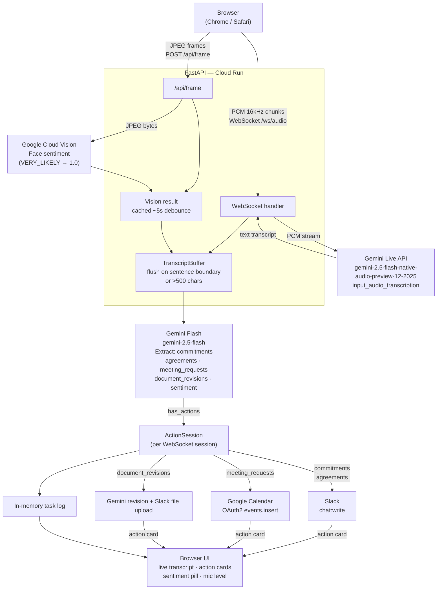

# Meeting Agent — Architecture

This file is the concise system-flow companion to [PROJECT.md](PROJECT.md). Contract, RCA, and product scope live there.

## System Flow



## Key Design Decisions

| Decision | Rationale |
|---|---|
| Gemini Live as sole STT | Real-time bidirectional streaming with built-in input transcription |
| No silence gating | Gating causes Gemini to miss utterance endings |
| Fire-and-forget dispatch | Slack/Calendar (~1s) must not block Gemini receive loop |
| Per-session `TranscriptBuffer` + `ActionSession` | No state bleed across concurrent WebSocket connections |
| Document revision treated as an action | Keeps the demo focused on live execution, not post-meeting summary |
| Sentiment adjusts content, not gate | ⚠️ flag + 1-day buffer on negative/uncertain; action always fires |
| OAuth2, not API key | Calendar API requires user identity |
| `asyncio.to_thread()` for Vision + Calendar | Both SDKs are sync; wrapping prevents event loop blocking |

## Deploy

```bash
gcloud run deploy meeting-agent \
  --source . \
  --region us-central1 \
  --allow-unauthenticated \
  --set-env-vars GOOGLE_API_KEY=...,SLACK_BOT_TOKEN=...,SLACK_CHANNEL=...,GOOGLE_CLOUD_PROJECT=...,GOOGLE_CALENDAR_TOKEN_JSON=...
```
