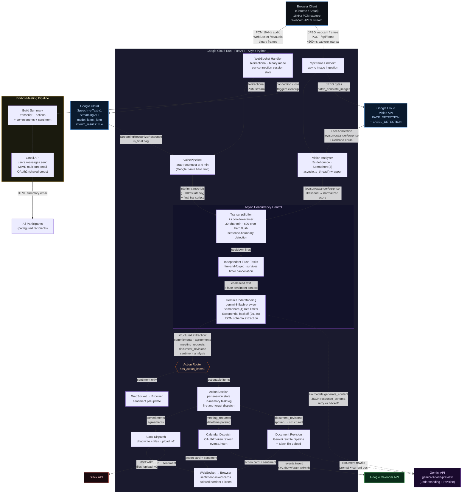

# Google Meet Premium: AI Meeting Agent — Architecture

## System Architecture



## Real-Time Data Flow

```
 T+0.0s   User speaks: "Let's schedule a follow-up Tuesday at 2pm"
 │
 T+0.1s   Browser MediaRecorder captures PCM chunk → WebSocket binary frame
 │
 T+0.3s   Cloud STT returns interim transcript (is_final=false)
 │         → Browser renders italicized preview text
 │         → Actions panel: pulsing "Analyzing transcript..." indicator
 │
 T+1.0s   Cloud STT returns final transcript (is_final=true)
 │         → Browser commits text to transcript log
 │         → TranscriptBuffer appends segment, resets 2s cooldown timer
 │
 T+1.2s   Webcam frame captured → Vision API face detection
 │         → joy_likelihood: VERY_LIKELY → normalized to "positive"
 │         → Cached in buffer as current face sentiment
 │
 T+3.0s   Cooldown fires (2s since last segment)
 │         → Spawns independent _execute_flush task (survives cancellation)
 │         → Sends coalesced text + sentiment to Gemini understanding
 │
 T+3.1s   Gemini gemini-3-flash-preview extracts structured JSON:
 │         {
 │           "meeting_requests": [{"when": "Tuesday 2pm", "who": ["team"]}],
 │           "sentiment": "positive",
 │           "commitments": [],
 │           "document_revisions": []
 │         }
 │
 T+3.5s   ActionSession dispatches (fire-and-forget):
 │         → Calendar: events.insert (OAuth2, auto-refresh if expired)
 │         → Sentiment pill updated via WebSocket
 │
 T+4.0s   Action card appears in Browser UI:
 │         → "Calendar · Confident" with green left border
 │         → Linked to facial sentiment at T+1.2s capture time
 │
 T+End    WebSocket closes → meeting cleanup triggers:
 │         → Build HTML summary (transcript + all actions + sentiment log)
 │         → Gmail: users.messages.send (MIME email, shared OAuth2 creds)
 │         → Session state garbage collected
```

## Concurrency Architecture

```
Main Event Loop (asyncio)
├── WebSocket /ws/audio (per connection)
│   ├── _recv_loop: binary frames → VoicePipeline.send_audio()
│   ├── VoicePipeline._run_stream: Cloud STT bidirectional streaming
│   │   ├── _request_gen: yields StreamingRecognizeRequest (audio chunks)
│   │   └── response handler: interim/final → TranscriptBuffer.add()
│   └── _watch_session: polls session for outbound messages → ws.send()
│
├── TranscriptBuffer (per session)
│   ├── Cooldown timer: asyncio.Task, cancelled + recreated on new speech
│   └── _execute_flush: independent task (not cancellable)
│       └── Gemini semaphore (4 concurrent) → understanding extraction
│           └── ActionSession.dispatch (fire-and-forget tasks)
│               ├── _bg_tasks set (prevents GC of fire-and-forget tasks)
│               └── Each action: Slack / Calendar / Doc revision
│
├── POST /api/frame (debounced)
│   └── asyncio.to_thread(vision_client.batch_annotate_images)
│       └── Result cached globally (5s debounce window)
│
└── Connection close handler
    ├── Drain _bg_tasks (wait for in-flight actions)
    ├── Build summary → Gmail send
    └── Cleanup session state
```

## Google Cloud Services (6 Services, 15+ API Calls)

| Service | SDK | Key API Calls | Concurrency Control | File |
|---------|-----|---------------|---------------------|------|
| **Gemini API** | `google-genai` | `aio.models.generate_content` (understanding), `aio.models.generate_content` (doc revision), `models.get` (startup validation) | Semaphore(4), exponential backoff 2s/4s, 3 retries | `understanding.py`, `documents.py`, `main.py` |
| **Cloud Speech-to-Text v1** | `google-cloud-speech` | `streaming_recognize` (bidirectional), `StreamingRecognizeRequest` (config + audio) | Auto-reconnect at 4 min (5-min Google limit), single stream per session | `voice.py` |
| **Cloud Vision API** | `google-cloud-vision` | `batch_annotate_images` (FACE_DETECTION + LABEL_DETECTION) | Semaphore(3), 5s debounce, `asyncio.to_thread` (sync SDK) | `vision.py` |
| **Google Calendar API** | `google-api-python-client` | `events().insert()`, `credentials.refresh()` | OAuth2 auto-refresh, `asyncio.to_thread` (sync SDK) | `actions.py` |
| **Gmail API** | `google-api-python-client` | `users().messages().send()`, `credentials.refresh()` | Shared OAuth2 creds with Calendar, MIME construction | `email_summary.py` |
| **Cloud Run** | Docker | Container hosting (python:3.12-slim, port 8080) | Unauthenticated, us-central1, custom SA | `Dockerfile` |

## Key Design Decisions

| Decision | Rationale | Technical Detail |
|----------|-----------|-----------------|
| Cloud STT v1 streaming (not batch) | ~300ms interim results enable real-time UX | Bidirectional streaming with `interim_results=true`, `latest_long` model |
| 2s transcript buffer cooldown | Balances API cost vs. perceived latency | Reduced from 8s after testing; 30-char min prevents empty flushes |
| Independent flush tasks | Prevents race condition: new audio cancelling in-flight Gemini calls | `_execute_flush` spawned as separate `asyncio.Task`, survives timer `cancel()` |
| Fire-and-forget action dispatch | Slack/Calendar (~1s each) must not block STT receive loop | `asyncio.create_task()` + `_bg_tasks` set prevents garbage collection |
| Per-session state isolation | No bleed across concurrent WebSocket connections | `TranscriptBuffer` + `ActionSession` instantiated per connection, cleaned up on close |
| Sentiment-linked action cards | Face sentiment at capture time gives context to commitments | Vision result cached globally, attached to understanding output, rendered as colored card borders |
| Shared OAuth2 token (Calendar + Gmail) | Single auth flow covers both scopes | `calendar.events` + `gmail.send` in one token; auto-refresh before each API call |
| `asyncio.to_thread()` for sync SDKs | Vision + Calendar SDKs are synchronous | Wrapping prevents blocking the async event loop |
| Proactive STT reconnect at 4 min | Google enforces 5-min streaming limit silently | Timer-based reconnect with seamless transcript continuity |
| Gemini JSON schema extraction | Structured output ensures reliable action parsing | `response_schema` parameter enforces typed JSON output from LLM |
